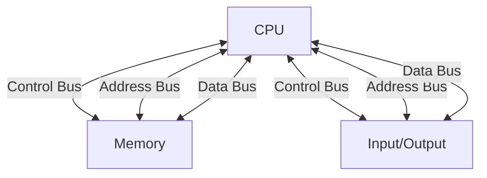

Tags  : #lecture_01 #COA #week_01

# CSC 2106 — Computer Organization and Architecture

## Lecture 1: Microcomputer Systems

> **Course:** CSC 2106 — Computer Organization and Architecture **Department:** Computer Science, Faculty of Science and Technology **Week:** 1 | **Semester:** Summer 25-26

---

## 📋 Table of Contents

- [[#Lecture Outline]]
- [[#Components of a Microcomputer System]]
- [[#The System Board (Motherboard)]]
- [[#Memory]]
- [[#Memory Operations]]
- [[#RAM and ROM]]
- [[#Buses]]
- [[#CPU]]
- [[#Intel 8086 Microprocessor Organization]]
- [[#I/O Ports]]
- [[#Instruction Execution]]
- [[#Timing]]
- [[#Programming Languages]]
- [[#Advantages — High-Level vs Assembly]]
- [[#Key Takeaways]]
- [[#Quick Revision Notes]]
- [[#FAQ & Exam Questions]]
- [[#Final Cheat Sheet]]

---

## 📌 Lecture Outline

1. Introduction to the architecture of microcomputers and IBM PC
2. Peripherals and their relations to software/programs
3. What a computer does while executing instructions
4. Advantages and disadvantages of assembly language programming

> [!NOTE] As a microcomputer user, you already know most of these terms from everyday experience. This lecture formalizes that knowledge.

---

## 🖥️ Components of a Microcomputer System

A microcomputer system is made up of three major hardware groupings:

### 1. System Unit

The physical box/enclosure that houses the core computing components (motherboard, power supply, drives, etc.).

### 2. I/O Devices (Peripherals)

Devices that allow a user to interact with the computer:

- **Keyboard** — input device
- **Display Unit (Monitor)** — output device
- **Disk Drives** — secondary storage (input/output)

> [!TIP] Peripherals are anything _external_ to the system unit that connects for input or output. Examples: mouse, printer, scanner, USB drives.

### 3. Integrated Circuit (IC)

- Contains millions/billions of **transistors**
- Operates using **digital circuits** — only two states: `0` (low voltage) and `1` (high voltage)
- The fundamental unit is the **Bit (Binary Digit)**: either `0` or `1`

```
Bit = Binary Digit = 0 or 1
Everything the computer does is based on combinations of these two values.
```

> [!IMPORTANT] All data — numbers, text, images, audio — is ultimately stored and processed as combinations of 0s and 1s.

---

### Inside the System Unit — Three Key Circuit Types

|Circuit Type|Role|
|---|---|
|**CPU**|Brain of the computer; controls all operations|
|**Memory Circuits**|Stores information (programs + data)|
|**I/O Circuits**|Communicates with I/O devices (peripherals)|

#### CPU (Central Processing Unit)

- The **brain** of the computer
- Controls **all operations**
- Implemented as a **single-chip processor** → called a **Microprocessor**
- Examples: Intel 8086, Intel Core i7, AMD Ryzen

#### Memory Circuits

- Store information that the CPU is currently working with
- Holds both **instructions** (program code) and **data**

#### I/O Circuits

- Allow the CPU to communicate with external I/O devices
- Usually located on **add-in cards** (expansion cards)

---

## 🔌 The System Board (Motherboard)

### Definition

The **System Board** (also called **Motherboard**) is the main printed circuit board that resides inside the system unit.

### What it Contains

- **Microprocessor** (CPU)
- **Memory circuits** (RAM slots)
- **Expansion slots** → for connecting **add-in cards / add-in boards**

### Expansion Slots & Add-in Cards

- I/O circuits are typically located on **add-in cards** (also called expansion cards)
- Examples: GPU (graphics card), sound card, network card
- These cards plug into expansion slots on the motherboard (e.g., PCIe slots)

```
System Unit
└── Motherboard
    ├── CPU (Microprocessor)
    ├── Memory (RAM)
    ├── Expansion Slots
    │   ├── Add-in Card (GPU)
    │   ├── Add-in Card (Sound)
    │   └── Add-in Card (Network)
    └── Connectors (USB, SATA, etc.)
```

> [!NOTE] Modern motherboards integrate many I/O functions (USB, audio, network) directly onto the board itself, reducing the need for separate add-in cards.

---

## 💾 Memory

### What is Memory?

Memory stores all information that the processor is actively working with — both the program instructions being executed and the data being processed.

---

### Bits and Bytes

|Unit|Definition|
|---|---|
|**Bit**|A single binary digit — value is `0` or `1`|
|**Byte**|A group of **8 bits**|
|**Nibble**|4 bits (half a byte — not in lecture, but commonly used)|

- A single **memory circuit element** can store **one bit** of data
- Memory circuits are organized into groups of **8 bits** → forming **1 Byte**

```
1 Byte = 8 Bits
Example byte: 0 1 1 0 1 0 0 1
              ↑                ↑
           Bit 7 (MSB)    Bit 0 (LSB)
```

> [!IMPORTANT] Bit positions are numbered **right to left**, starting from **0**.
> 
> - Bit 0 = Least Significant Bit (LSB) — rightmost
> - Bit 7 = Most Significant Bit (MSB) — leftmost (in a byte)

---

### Memory Addresses

- Each byte in memory has a unique **address** — like a street address for a house
- The address tells the CPU _where_ in memory to find or store data
- **Memory bytes are identified by their address**

> [!IMPORTANT] **Address vs Contents — Key Distinction:**
> 
> |Property|Address|Contents|
> |---|---|---|
> |Uniqueness|**Fixed & unique** — no two bytes share an address|**Not unique** — multiple locations can hold the same value|
> |Size|Depends on the processor (e.g., 20-bit, 24-bit)|Always **8 bits** (1 byte)|
> |Meaning|_Where_ the data is stored|_What_ is stored at that location|

**Example from the lecture diagram:**

|Address|Contents (8-bit binary)|
|---|---|
|0|`0 1 1 0 0 0 0 1`|
|1|`0 1 0 1 1 1 1 0`|
|2|`1 1 1 1 1 1 1 1`|
|3|`0 0 0 0 0 0 0 0`|
|4|`1 1 1 0 1 1 0 1`|
|5|`0 0 0 0 1 1 0 1`|
|6|`1 1 0 0 1 1 1 0`|
|7|`0 0 1 0 1 1 0 1`|

> [!NOTE] The number of bits used for an address depends on the **processor**:
> 
> - Intel 8086 → **20-bit** address bus
> - Intel 80286 → **24-bit** address bus
> - Modern x86-64 → **64-bit** address (physically ~48 bits used)

---

### Memory Byte Addressing — How Many Bytes Can Be Addressed?

**Formula:**

```
Number of addressable bytes = 2^(number of address bits)
```

**Example from lecture:**

```
Processor uses 20-bit address
→ 2^20 = 1,048,576 bytes
→ In computer terminology: 2^20 = 1 Mega
→ Therefore: 20-bit address → can address 1 MB of memory
```

|Address Bus Width|Addressable Memory|
|---|---|
|20-bit (Intel 8086)|2²⁰ = 1 MB|
|24-bit (Intel 80286)|2²⁴ = 16 MB|
|32-bit|2³² = 4 GB|
|64-bit|2⁶⁴ = ~18.4 Exabytes (theoretical)|

> [!TIP] **Memory Mnemonics:**
> 
> - 2¹⁰ = 1 Kilo (K) = 1,024
> - 2²⁰ = 1 Mega (M) = 1,048,576
> - 2³⁰ = 1 Giga (G) = 1,073,741,824
> - 2⁴⁰ = 1 Tera (T)

---

### Memory Word

- In a microcomputer: **Two bytes = One Word** (16 bits for IBM PC / 8086)
- To store a **word** (16-bit value), you need **a pair of successive memory bytes**
- The **lower address** of the two bytes is used as the word's address

**Example:**

```
Memory Word at address 2:
  Address 2 → Low byte  (bits 0–7)
  Address 3 → High byte (bits 8–15)
```

> [!IMPORTANT] The word at address 2 occupies addresses **2 and 3** — the lower address (2) is the word's address.

---

### Bit Positions in a Byte and a Word

```
BYTE (8 bits):
Bit #:  7  6  5  4  3  2  1  0
        ↑                    ↑
       MSB                  LSB
Example: 0  0  1  1  0  1  0  1

WORD (16 bits = 2 bytes):
Bit #: 15 14 13 12 11 10  9  8 | 7  6  5  4  3  2  1  0
       ←——— HIGH BYTE ————————→ | ←——— LOW BYTE ————————→
       (Higher address)         | (Lower address)
```

|Bit Range|Name|Address|
|---|---|---|
|Bits 0–7|**Low byte**|Lower address of the word|
|Bits 8–15|**High byte**|Higher address of the word|

> [!REMEMBER] Bit numbering always goes **right to left**, starting from **0**. Bit 0 is the rightmost (LSB); the highest-numbered bit is the leftmost (MSB).

---

## ⚙️ Memory Operations

The processor can perform exactly **two operations** on memory:

### 1. Read (Fetch)

- CPU retrieves (copies) data from a memory location
- Only a **copy** is obtained — the original data **remains unchanged**
- The contents at the memory location are **not altered**

```
Read Operation:
Memory[address] ——copy——> CPU Register
(original stays)
```

### 2. Write (Store)

- CPU sends data to a memory location to be stored
- The new data **replaces** whatever was there before
- The **original/previous contents are permanently lost**

```
Write Operation:
CPU Register ——overwrite——> Memory[address]
(previous value is gone)
```

> [!WARNING] Writing to memory is **destructive** — the previous content is lost. There is no "undo" at the hardware level.

> [!COMMON MISTAKE] Many students think "reading" removes data. It does NOT. Only a **write** changes memory contents.

---

## 🗄️ RAM and ROM

### RAM — Random Access Memory

|Property|Detail|
|---|---|
|Access|Can be **read and written**|
|Purpose|Stores running programs and active data|
|Volatility|**Volatile** — contents are **lost** when power is turned off|
|Speed|Fast access|

- "Random Access" means any byte can be accessed directly by address (not sequentially)
- The CPU's working memory — all programs run from RAM

### ROM — Read Only Memory

|Property|Detail|
|---|---|
|Access|**Read only** — cannot be written (normally)|
|Purpose|Stores firmware and boot programs|
|Volatility|**Non-volatile** — retains values even when power is off|
|Example|BIOS/UEFI firmware|

- **Firmware** = software stored in ROM
- ROM is responsible for loading **start-up programs** (bootstrap/BIOS)
- Once manufactured with data, ROM cannot be changed (classic ROM)

### Comparison Table

|Feature|RAM|ROM|
|---|---|---|
|Read|✅ Yes|✅ Yes|
|Write|✅ Yes|❌ No (normally)|
|Volatile|✅ Yes (data lost on power off)|❌ No (data retained)|
|Usage|Running programs, active data|Firmware, boot code|
|Speed|Fast|Slower (typically)|
|Cost|Higher per GB|Lower per GB|

> [!NOTE] **Modern variants:** Today there are EPROM (Erasable), EEPROM (Electrically Erasable), and Flash memory (used in SSDs and USB drives) — these blur the ROM boundary since they can be rewritten under controlled conditions.

> [!EXAM TIP] A classic exam question: _"Why does your computer 'forget' your work when power is cut?"_ Answer: Because programs and data are in **RAM**, which is **volatile**.

---

## 🚌 Buses

### What is a Bus?

- A **bus** is a set of wires/connections along which **signals travel** between the CPU, memory, and I/O devices
- The processor communicates with memory and I/O devices using **signals** carried over buses

### Three Types of Buses



|Bus Type|Direction|Purpose|
|---|---|---|
|**Address Bus**|CPU → Memory/IO|CPU sends the **address** of the memory location to access|
|**Data Bus**|Bidirectional|Carries **actual data** between CPU and memory/IO|
|**Control Bus**|CPU → Memory/IO|CPU sends **control signals** (e.g., read/write command)|

### Detailed Explanation

#### Address Bus

- CPU places the **address** of the target memory location on the address bus
- **Unidirectional** (CPU → memory/IO)
- Width determines how much memory can be addressed (e.g., 20-bit → 1 MB)

#### Data Bus

- Carries the actual **data** being transferred
- **Bidirectional** — data flows in both directions (read: memory→CPU, write: CPU→memory)
- Width determines how much data is transferred at once (8-bit, 16-bit, 32-bit, 64-bit)

#### Control Bus

- CPU sends **control signals** to coordinate operations
- Examples of control signals: Read (RD), Write (WR), Memory/IO select, Interrupt signals
- Ensures memory and I/O know _what operation_ to perform

> [!IMPORTANT] **Bus width matters:**
> 
> - Wider **address bus** → more memory addressable
> - Wider **data bus** → more data transferred per cycle → faster performance

**System Bus = Address Bus + Data Bus + Control Bus** (collectively)

> [!EXAM TIP] Know the function of each bus type — this is a very common exam question.

---

## 🧠 CPU (Central Processing Unit)

### What is the CPU?

- The **brain** of the computer
- Controls the computer by **executing programs** (system software or applications)
- Interprets and executes instructions one at a time

### Machine Language

- Each CPU instruction is stored as a **bit string** (sequence of 0s and 1s)
- **Machine Language** = the language of 0s and 1s that the CPU directly understands
- Instructions are designed to be **simple and basic**
- Programs = sequences of very basic operations

### Instruction Set Architecture (ISA)

- **Instruction Set** = the complete set of instructions a CPU can perform
- Each CPU family has its **own unique instruction set**
- Example: Intel x86 instruction set is different from ARM instruction set

> [!NOTE] This is why programs compiled for Intel x86 don't run on ARM processors without recompilation or emulation — they have different instruction sets.

### Machine Language Instruction Structure

```
Instruction = Opcode + Operand(s)

Opcode   → Specifies the TYPE of operation (e.g., ADD, MOV, JMP)
Operand  → Specifies the DATA or ADDRESS to operate on
```

---

## 🔬 Intel 8086 Microprocessor Organization

The Intel 8086 is divided into two main functional units:

```
┌──────────────────────────────────────────────────────┐
│              Intel 8086 Microprocessor               │
│                                                      │
│  ┌─────────────────┐    ┌────────────────────────┐  │
│  │ Execution Unit  │    │  Bus Interface Unit     │  │
│  │     (EU)        │    │       (BIU)             │  │
│  │                 │    │                         │  │
│  │  Data Registers │    │  Segment Registers:     │  │
│  │  AX, BX, CX, DX│    │  CS, DS, SS, ES         │  │
│  │                 │    │                         │  │
│  │  Pointer Regs:  │    │  Instruction Pointer:   │  │
│  │  SP, BP         │    │  IP                     │  │
│  │                 │    │                         │  │
│  │  Index Regs:    │    │  Instruction Queue (IQ) │  │
│  │  SI, DI         │    │  (up to 6 bytes)        │  │
│  │                 │    │                         │  │
│  │  Temp Registers │    │  Bus Control Logic      │  │
│  │  ALU            │    │  ←——→ External Bus      │  │
│  │  FLAGS Register │    │                         │  │
│  └────────┬────────┘    └────────────────────────┘  │
│           │                                          │
│           └──────── Internal BUS ───────────────────│
└──────────────────────────────────────────────────────┘
```

---

### Execution Unit (EU)

The EU is responsible for **actually executing instructions**.

#### Components of EU:

|Component|Purpose|
|---|---|
|**ALU** (Arithmetic Logic Unit)|Performs arithmetic (+, -, ×, ÷) and logical (AND, OR, NOT, XOR) operations|
|**Data Registers** (AX, BX, CX, DX)|General-purpose registers for holding data during operations|
|**Pointer Registers** (SP, BP)|Stack Pointer and Base Pointer — used for stack operations|
|**Index Registers** (SI, DI)|Source Index and Destination Index — used for string/array operations|
|**Temporary Registers**|Hold intermediate operands for ALU operations|
|**FLAGS Register**|Individual bits reflect the result of computations|

#### Registers — Key Concept

- A **register** is like a memory location **inside the CPU**
- Much faster than main memory (zero wait states)
- Referred to by **name** (e.g., AX) not by address number (unlike RAM)
- 16-bit registers in 8086; can be split:
    - `AX` → `AH` (high byte) + `AL` (low byte)
    - `BX` → `BH` + `BL`
    - `CX` → `CH` + `CL`
    - `DX` → `DH` + `DL`

#### FLAGS Register

- Contains individual **flag bits** that reflect the outcome of operations
- Common flags:

|Flag|Name|Meaning|
|---|---|---|
|ZF|Zero Flag|Set if result = 0|
|SF|Sign Flag|Set if result is negative|
|CF|Carry Flag|Set if carry/borrow out of MSB|
|OF|Overflow Flag|Set if signed overflow occurred|
|PF|Parity Flag|Set if result has even number of 1-bits|

---

### Bus Interface Unit (BIU)

The BIU handles all **communication between the EU and external memory/IO**.

#### Functions:

- **Enables communication** between the EU and memory or I/O circuits
- **Transmits address, data, and control signals** on the external buses
- Prefetches instructions to keep the EU busy

#### BIU Registers:

|Register|Name|Purpose|
|---|---|---|
|**CS**|Code Segment|Points to the segment containing program code|
|**DS**|Data Segment|Points to the segment containing data|
|**SS**|Stack Segment|Points to the stack segment|
|**ES**|Extra Segment|Extra segment for additional data|
|**IP**|Instruction Pointer|Points to the next instruction to be fetched|

> [!IMPORTANT] BIU registers hold **addresses of memory locations** (specifically, segment base addresses). The BIU uses these to calculate the actual physical memory address.

---

### EU and BIU Working Together

- EU and BIU are connected via an **internal bus**
- They **work in parallel** (pipelining) to improve performance:

```
While EU executes instruction N:
  BIU prefetches instruction N+1, N+2, ... (up to 6 bytes ahead)
  → Stored in the Instruction Queue (IQ)
```

- This technique is called **Instruction Prefetch**
- **Purpose:** To speed up the processor by overlapping fetch and execute phases

> [!NOTE] If the EU needs memory access (e.g., to read data), the BIU **suspends instruction prefetch** and handles the required memory operation first.

#### Instruction Prefetch — Why it Matters

Without prefetch:

```
Fetch N → Execute N → Fetch N+1 → Execute N+1 → ... (sequential, slow)
```

With prefetch (pipelining):

```
Fetch N  │ Execute N  │            │
          │ Fetch N+1 │ Execute N+1│
                      │ Fetch N+2  │ Execute N+2 ...
```

---

## 🔗 I/O Ports

### What is an I/O Port?

- I/O ports function as **transfer points** between the CPU and I/O devices
- They are the interface through which I/O devices connect to the system

### Two Types of Ports

|Feature|Serial Port|Parallel Port|
|---|---|---|
|Data transfer|**1 bit at a time**|**8 or 16 bits at a time**|
|Speed|**Slower**|**Faster**|
|Wiring|Fewer wires needed|Requires more wiring connections|
|Typical devices|Slow devices (e.g., **Keyboard**, mouse, modem)|Fast devices (e.g., **Disk drive**, printer)|

> [!NOTE] Modern computers have largely replaced classic serial/parallel ports with **USB** (Universal Serial Bus) and other modern interfaces (SATA, PCIe, Thunderbolt), which combine high speed with fewer wires.

---

## ⚡ Instruction Execution

### How the CPU Operates — The Fetch-Execute Cycle

Every instruction a CPU runs goes through a repeating cycle:

```
┌──────────────────────────────────────────────────┐
│               FETCH-EXECUTE CYCLE                │
│                                                  │
│   ┌─────────┐     ┌──────────┐     ┌──────────┐ │
│   │  FETCH  │────>│  DECODE  │────>│  FETCH   │ │
│   │         │     │          │     │  DATA    │ │
│   └─────────┘     └──────────┘     └────┬─────┘ │
│                                         │        │
│   ┌─────────┐     ┌──────────┐          │        │
│   │  STORE  │<────│ EXECUTE  │<─────────┘        │
│   │ result  │     │          │                   │
│   └─────────┘     └──────────┘                   │
│       │                                          │
│       └──────────────────────────────────────────┘
│                  (repeat for next instruction)    │
└──────────────────────────────────────────────────┘
```

### Fetch Phase (Steps)

1. **Fetch** an instruction from memory (using IP/PC register for address)
2. **Decode** the instruction to determine what operation to perform
3. **Fetch data** (operands) from memory if necessary

### Execute Phase (Steps)

4. **Perform the operation** on the data (using ALU if arithmetic/logic)
5. **Store the result** if needed (back to register or memory)

### Machine Language Instruction Parts

```
Machine Instruction = [ OPCODE ] + [ OPERAND(S) ]

OPCODE   → Specifies the type of operation
           Example: ADD, SUB, MOV, JMP

OPERAND  → Data or memory address to operate on
           Example: Memory address, register name, immediate value
```

> [!EXAM TIP] The fetch-execute cycle is also called the **instruction cycle** or **machine cycle**. Know all steps and their order.

---

## ⏱️ Timing

### Why is Timing Important?

Execution steps must occur in a specific, **orderly sequence**. A **clock circuit** controls the processor by generating regular pulses.

### Clock Concepts

|Term|Definition|
|---|---|
|**Clock Pulse**|A single high-low signal cycle generated by the clock circuit|
|**Clock Period**|The **time interval between two pulses** (duration of one cycle)|
|**Clock Rate / Speed**|The **number of pulses per second** — measured in **Hz (Hertz)**|

### Units of Clock Speed

|Unit|Value|Example|
|---|---|---|
|1 MHz|1,000,000 (1 million) pulses/second|Old 8086: 4.77 MHz|
|1 GHz|1,000,000,000 (1 billion) pulses/second|Modern CPUs: 2–5 GHz|

### Timing Task from Lecture

> **Problem:** A computer has a 2.3 GHz processor. How many pulses per second?
> 
> **Solution:**
> 
> ```
> 2.3 GHz = 2.3 × 1,000,000,000
>         = 2,300,000,000 pulses per second
>         = 2.3 billion clock pulses per second
> ```

> [!IMPORTANT] **Higher clock rate ≠ always faster performance.** Other factors matter: instruction set efficiency, cache size, number of cores, pipeline depth, and memory speed. This is called the **"MHz myth"** in modern computing.

### Clock Period Formula

```
Clock Period (T) = 1 / Clock Rate (f)

Example: For 2.3 GHz processor:
T = 1 / 2,300,000,000 ≈ 0.435 nanoseconds per clock cycle
```

---

## 💻 Programming Languages

Three levels of programming languages exist, from lowest to highest abstraction:

### 1. Machine Language

- **The language of 0s and 1s** (bit strings)
- Directly understood by the CPU — no translation needed
- Extremely difficult for humans to write and read
- Example: `10110000 01100001` (moves value 97 into register AL on x86)

### 2. Assembly Language

- Uses **symbolic names** (mnemonics) to represent operations, registers, and memory locations
- Human-readable version of machine language
- Example: `MOV AX, A` (move value of variable A into register AX)
- Must be converted to machine language using an **Assembler**

```
Assembly Source Code
        ↓  [Assembler]
Machine Language (0s and 1s)
        ↓  [Loader]
Execution by CPU
```

### 3. High-Level Language

- Allows programmers to write in a **more natural, English-like language**
- Examples: C, C++, Java, Python, C#
- Must be converted to machine language using a **Compiler** (or **Interpreter**)

```
High-Level Source Code (C++, Java, Python...)
        ↓  [Compiler / Interpreter]
Machine Language
        ↓  [CPU executes]
Output
```

### Language Level Comparison

|Feature|Machine Language|Assembly Language|High-Level Language|
|---|---|---|---|
|Readability|Very low|Medium|High|
|Portability|None (CPU-specific)|Low (CPU-specific)|High (cross-platform)|
|Speed of execution|Fastest|Very fast|Depends on compiler|
|Development speed|Very slow|Slow|Fast|
|Translation tool needed|None|Assembler|Compiler/Interpreter|
|Memory control|Full|Full|Limited|
|Example|`1011 0000`|`MOV AL, 5`|`int x = 5;`|

---

## ⚖️ Advantages — High-Level vs Assembly Language

### High-Level Language Advantages

- **Closer to natural language** → algorithm conversion is easier
- **Fewer instructions** and less development time than assembly
- **Programs can be executed on any machine** (portability with recompilation)
- Easier to debug, maintain, and scale

### Assembly Language Advantages

- **Very close to machine language** → programs are **faster and shorter**
- Easy to **read/write to specific memory locations** and I/O ports
- Can be used as a **sub-program** (inline assembly) within high-level languages
- Allows you to understand **exactly how the computer thinks and operates**
- Essential for **device drivers, embedded systems, OS kernels, real-time systems**

### Full Comparison Table

|Criterion|High-Level|Assembly|
|---|---|---|
|Proximity to hardware|Far|Very close|
|Speed of resulting program|Moderate|Very fast|
|Code length|Short|Long|
|Portability|High|Low (CPU-specific)|
|Memory access control|Indirect|Direct|
|Learning difficulty|Easier|Harder|
|Development time|Shorter|Longer|
|Use case|General applications|System software, performance-critical code|

> [!NOTE] Modern C++ (which you use!) actually supports **inline assembly** using the `asm` keyword, bridging the gap between high-level and assembly.
> 
> ```cpp
> // C++ with inline assembly example
> int result;
> int a = 10, b = 5;
> __asm__ (
>     "addl %%ebx, %%eax;"
>     : "=a"(result)
>     : "a"(a), "b"(b)
> );
> // result = 15
> ```

---

## 📚 Key Takeaways

1. A microcomputer system consists of the **System Unit** (CPU + Memory + I/O circuits), **I/O Devices**, and **ICs**
2. The **Motherboard** contains the CPU and memory, with expansion slots for add-in cards
3. Memory is organized in **bytes** (8 bits); two bytes = one **word**
4. **Address** is fixed and unique; **Contents** hold the actual data (8 bits, not unique)
5. A 20-bit address bus can address **2²⁰ = 1 MB** of memory
6. The CPU performs two memory operations: **Read** (non-destructive) and **Write** (destructive)
7. **RAM** is volatile (loses data on power off); **ROM** is non-volatile (retains data)
8. Three buses: **Address** (where), **Data** (what), **Control** (how/when)
9. The Intel 8086 has two units: **EU** (executes instructions) and **BIU** (handles bus communication)
10. CPU follows the **Fetch-Execute Cycle** for every instruction
11. **Clock rate** (in MHz/GHz) determines how fast instructions are processed
12. Three language levels: **Machine** (0s/1s) → **Assembly** (mnemonics) → **High-Level** (natural)

---

## ⚡ Quick Revision Notes

```
MEMORY:
  1 bit = 0 or 1
  8 bits = 1 byte
  2 bytes = 1 word (8086)
  20-bit address → 1 MB addressable

BUSES:
  Address Bus → WHERE (location)
  Data Bus    → WHAT  (data)
  Control Bus → HOW   (read/write command)

8086 UNITS:
  EU  = Execution Unit  (ALU, Registers, Flags)
  BIU = Bus Interface Unit (Segment registers, IP, IQ)

REGISTERS (EU):  AX, BX, CX, DX, SP, BP, SI, DI
REGISTERS (BIU): CS, DS, SS, ES, IP

FETCH-EXECUTE CYCLE:
  1. Fetch instruction
  2. Decode instruction
  3. Fetch data (if needed)
  4. Execute
  5. Store result (if needed)

CLOCK:
  1 MHz = 1,000,000 pulses/sec
  1 GHz = 1,000,000,000 pulses/sec
  Period = 1 / frequency

LANGUAGES:
  Machine  → 0s and 1s (no translator needed)
  Assembly → Mnemonics (needs Assembler)
  High-Level → Natural (needs Compiler/Interpreter)
```

---

## ❓ FAQ & Exam Questions

> [!FAQ] **Q: What is the difference between a bit and a byte?** A: A **bit** is a single binary digit (0 or 1). A **byte** is a group of 8 bits. A byte is the smallest addressable unit of memory.

> [!FAQ] **Q: Why does a 20-bit address bus address exactly 1 MB?** A: Because each bit can be 0 or 1 (2 values), and 20 bits can represent 2²⁰ = 1,048,576 unique addresses. In computing, 2²⁰ is defined as 1 Mega, so 2²⁰ bytes = 1 MB.

> [!FAQ] **Q: What is the difference between RAM and ROM?** A: RAM is volatile (data lost on power-off) and can be read and written. ROM is non-volatile (data retained without power) and is normally read-only. ROM stores firmware; RAM stores running programs and data.

> [!FAQ] **Q: What does the ALU do?** A: The ALU (Arithmetic Logic Unit) inside the CPU's Execution Unit performs all arithmetic operations (add, subtract, multiply, divide) and logical operations (AND, OR, NOT, XOR).

> [!FAQ] **Q: What is instruction prefetch and why is it used?** A: Instruction prefetch is when the BIU fetches the next instruction(s) from memory while the EU is still executing the current instruction. This overlapping (pipelining) speeds up the processor by reducing idle time.

> [!FAQ] **Q: What is the difference between serial and parallel ports?** A: Serial ports transfer 1 bit at a time (slower, fewer wires, used for slow devices like keyboards). Parallel ports transfer 8 or 16 bits at a time (faster, more wires, used for faster devices like disk drives).

> [!FAQ] **Q: What is the fetch-execute cycle?** A: The fundamental operating cycle of a CPU: (1) Fetch the instruction from memory, (2) Decode it, (3) Fetch any required data, (4) Execute the instruction, (5) Store the result. This repeats for every instruction.

### Possible Exam Questions

1. What are the three main components of a microcomputer system?
2. What is the difference between address and contents of a memory byte?
3. If a processor has a 24-bit address bus, how much memory can it address?
4. Explain the difference between RAM and ROM with examples.
5. Name and explain the three types of buses in a computer system.
6. What are the two main units of the Intel 8086 and what does each do?
7. List the registers of the EU and BIU in the Intel 8086.
8. What is instruction prefetch and how does it improve processor performance?
9. Describe the fetch-execute cycle with all its steps.
10. Compare assembly language and high-level language — give advantages of each.
11. A computer has a 4 GHz processor. How many clock pulses does it generate per second?
12. What is the difference between serial and parallel ports?
13. Explain the two memory operations a processor can perform.
14. What is a word in the context of the IBM PC/8086?

---

## 📝 Final Cheat Sheet

### Memory Quick Reference

|Term|Value|
|---|---|
|1 Byte|8 bits|
|1 Word (8086)|16 bits = 2 bytes|
|1 KB|2¹⁰ = 1,024 bytes|
|1 MB|2²⁰ = 1,048,576 bytes|
|1 GB|2³⁰ bytes|
|8086 address size|20 bits → 1 MB max|
|80286 address size|24 bits → 16 MB max|

### Key Definitions

|Term|Definition|
|---|---|
|**Bit**|Binary digit; 0 or 1|
|**Byte**|8 bits; smallest addressable unit|
|**Address**|Unique identifier for a memory byte (fixed)|
|**Contents**|Data stored at a memory address (changeable)|
|**Word**|2 bytes (16 bits) in 8086|
|**CPU**|Central Processing Unit; brain of computer|
|**ALU**|Arithmetic Logic Unit; performs math/logic|
|**Register**|High-speed storage inside CPU, referred to by name|
|**Bus**|Set of wires for signal transmission|
|**RAM**|Volatile read/write memory|
|**ROM**|Non-volatile read-only memory|
|**Firmware**|Software stored in ROM|
|**Assembler**|Converts assembly code to machine code|
|**Compiler**|Converts high-level code to machine code|
|**Clock Rate**|Speed of CPU clock in Hz/MHz/GHz|
|**Instruction Prefetch**|BIU fetches next instructions while EU executes current|
|**Opcode**|Part of machine instruction specifying the operation|
|**Operand**|Data or address that the opcode operates on|

### 8086 Register Cheat Sheet

```
EU Registers:
  Data:    AX (AH+AL), BX (BH+BL), CX (CH+CL), DX (DH+DL)
  Pointer: SP (Stack Pointer), BP (Base Pointer)
  Index:   SI (Source Index), DI (Destination Index)
  Flags:   FLAGS register (ZF, SF, CF, OF, PF, etc.)

BIU Registers:
  Segment: CS (Code), DS (Data), SS (Stack), ES (Extra)
  Pointer: IP (Instruction Pointer → next instruction address)
```

### Mnemonics / Memory Tricks

- **Buses:** "**A**ll **D**ata **C**omes" → Address, Data, Control
- **8086 units:** "**E**xecute **B**efore **I**nterfacing" → EU, BIU
- **Memory ops:** "**R**ead is s**a**fe (content stays), **W**rite **w**ipes" → Read preserves, Write destroys
- **RAM vs ROM:** "**RAM** = **R**uns **A**nd **M**ight die (volatile); **ROM** = **R**emains **O**n **M**achine"
- **Bit numbering:** "Start from **right**, count from **zero**"
- **Address bits → memory:** "2 to the power of N bytes" (N = number of address bits)

---

> [!NOTE] **Sources Referenced:**
> 
> - Assembly Language Programming and Organization of the IBM PC, Ytha Yu & Charles Marut, McGraw Hill, 1992 (ISBN: 0-07-072692-2)
> - Essentials of Computer Organization and Architecture, Linda Null & Julia Lobur (3rd Ed.)
> - W. Stallings, "Computer Organization and Architecture: Designing for Performance", 6th Ed., Prentice Hall, 2003
> - Computer Organization and Architecture by John P. Haynes

---

_Notes compiled from CSC 2106 Lecture 1 — Expanded with additional context for deeper understanding._ 